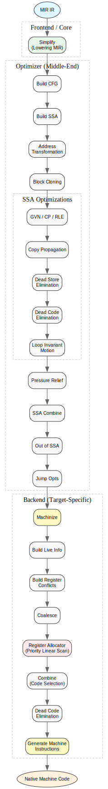

The Machine Code Generator: Implementation of ``mir-gen.c``
=========================================================

We have already conquered the high peaks of the MIR Core. We have seen how functions are born, how data is laid out, and how the universe is saved and loaded.

But now, we descend.

We are leaving the clean, well-lit world of the abstract machine and entering the **Machine Code Generator** (``mir-gen.c``). This is where the rubber meets the road—or rather, where the abstract syntax tree meets the unforgiving silicon.

Before we dive in, a warning:

.. warning::
   **DIFFICULTY LEVEL: HARD**
   
   This file is an implementation of a full-fledged backend compiler. Concepts like Register Allocation, Control Flow Graphs, SSA Form, and Data Flow Analysis are assumed knowledge here. The terrain is treacherous. Proceed with caution.

1. The Strategy Room: Optimization Pipeline
-------------------------------------------

The very top of ``mir-gen.c`` greets us with a battle plan—a diagram of the optimization pipeline.

This isn't just a flowchart; it's a promise. It tells us exactly how MIR transforms from a loose collection of instructions into tight machine code.

*   **Simplify:** Lowering MIR (handled in ``mir.c``).
*   **Build CFG:** Building the Control Flow Graph (basic blocks and edges).
*   **Build SSA:** Converting to Single Static Assignment Form (for -O2 and above).
*   **Machinize:** Machine-dependent transformation for ABI compliance.
*   **RA (Register Allocator):** Mapping virtual registers to physical CPU registers.
*   **Generate machine insns:** Final emission of binary machine code.

2. The Context of Power: ``gen_ctx``
------------------------------------

Just as ``mir.c`` had its context, ``mir-gen.c`` has ``gen_ctx``. But this one is built for war.

.. code-block:: c

    struct gen_ctx {
      MIR_context_t ctx;           /* The parent context */
      unsigned optimize_level;     /* How hard should we try? */
      MIR_item_t curr_func_item;   /* The patient currently on the table */
      /* Sub-contexts for each phase: */
      struct target_ctx *target_ctx;
      struct data_flow_ctx *data_flow_ctx;
      struct ssa_ctx *ssa_ctx;
      struct ra_ctx *ra_ctx;
      /* ... and many bitmaps and varrs ... */
    };

This structure is massive. It holds the state for every stage of the pipeline. Notice the sub-contexts: ``ssa_ctx``, ``ra_ctx``. This modular design keeps the massive codebase sane.

3. The Target Interface (``mir-gen-*.c``)
-----------------------------------------

Here lies a fascinating architectural decision.

.. code-block:: c

    #if defined(__x86_64__)
    #include "mir-gen-x86_64.c"
    #elif defined(__aarch64__)
    #include "mir-gen-aarch64.c"
    /* ... */
    #endif

MIR includes the target-specific generator code **directly into the source file**. This is a monolithic compilation approach.

*   **The Advantage:** The target-specific code has full access to the ``gen_ctx`` internals (via static functions and shared structs) without exposing a complex public API header.
*   **The Vibe:** It feels like loading a specific "cartridge" into the console. The generic generator logic runs, but when it needs to emit a specific opcode, it calls into the included target file.

4. The Building Blocks: ``bb_t`` and ``bb_insn_t``
--------------------------------------------------

Before we can optimize, we must organize. A flat list of instructions is useless for analysis. We need **Basic Blocks (BBs)**.

.. code-block:: c

    struct bb {
      size_t index;
      DLIST (in_edge_t) in_edges;   /* Who jumps to me? */
      DLIST (out_edge_t) out_edges; /* Where do I go? */
      DLIST (bb_insn_t) bb_insns;   /* The instructions inside me */
      bitmap_t in, out, gen, kill;  /* Data flow analysis sets */
    };

*   **The Basic Block:** A sequence of instructions with one entry and one exit. If you execute the first instruction, you are guaranteed to execute the last one.
*   **The Graph:** ``in_edges`` and ``out_edges`` form the **Control Flow Graph (CFG)**. This graph allows the compiler to reason about reachability and loops.
*   **The Wrapper:** ``bb_insn_t`` wraps a raw ``MIR_insn_t`` with extra data needed for optimization (like liveness info), keeping the original instruction clean.

5. The Analysis Begins: ``build_func_cfg``
------------------------------------------

This function is the **Architect**. It walks the linear instruction list and constructs the CFG.

*   **The Split:** It identifies "leaders"—instructions that start a new block (labels, targets of jumps, instructions after jumps).
*   **The Connect:** It wires up the edges. If Block A ends with ``JMP L1``, and Block B starts with ``L1``, it creates an edge A -> B.
*   **The Result:** A web of interconnected blocks, ready for traversal.

6. The Heart of the Analysis: CFG and Loops
-------------------------------------------

The structures defined here are the lifeblood of the optimizer. We are moving from a linear list of instructions to a rich graph representation.

*   **``struct edge``**: The synapses of the CFG brain. It connects ``src`` and ``dst`` blocks and knows if it's a ``fall_through`` or a jump, and if it's a ``back_edge`` (crucial for loop detection).
*   **``struct loop_node``**: This is where the compiler gets smart about loops. MIR builds a **Loop Tree**. Loops can be nested inside other loops. This structure tracks that hierarchy (``parent``, ``children``) and monitors register pressure (``max_int_pressure``).
*   **``struct func_cfg``**: The master map for a function. It holds the list of all basic blocks (``bbs``) and the ``root_loop_node`` (the function itself is the outermost loop).

7. Lazy Compilation: Basic Block Versioning (``bb_version``)
------------------------------------------------------------

This is one of MIR's most advanced features: **Lazy Basic Block Versioning (BBV)**.

Usually, a JIT compiles a whole function at once. MIR can compile *just a single basic block* when it is first executed.

*   **``bb_stub``**: A placeholder for a block of code that hasn't been generated yet.
*   **``bb_version``**: A specific compiled instance of a basic block.
*   **Thunk**: When the code jumps to a block that isn't ready, it hits a "thunk" (trampoline) that triggers the generator. Once generated, the thunk is rewritten to jump directly to the new machine code.

This allows MIR to start executing code incredibly fast, only paying the cost of compilation for the paths actually taken.

8. The Memory Game: ``gen_malloc`` and ``gen_free``
---------------------------------------------------

The generator has its own memory wrappers.

*   **``gen_malloc``**: Standard allocation, but aborts on failure using the context's error handler.
*   **``gen_malloc_and_mark_to_free``**: This is an **Arena-style** allocation strategy. The pointer is pushed to a ``to_free`` list. At the end of generation, MIR just iterates through this list and releases everything. This drastically simplifies memory management during complex graph transformations.

9. The Circle of Life: ``create_bb_insn`` and ``delete_bb_insn``
----------------------------------------------------------------

We are now managing the lifecycle of the optimization entities.

*   **Birth:** ``create_bb_insn`` wraps a raw instruction in its optimization cocoon (``bb_insn_t``). It initializes the liveness tracking, assigns a unique index (crucial for bitsets!), and sets up the default attributes.
*   **Death:** ``delete_bb_insn`` tears it down. It cleans up dead variable lists and frees the memory. Note: it doesn't delete the *raw instruction* (``MIR_insn_t``)—that's a separate layer of reality. It just removes the optimizer's metadata wrapper.

10. The Dead Variable Ledger: ``dead_var_t``
--------------------------------------------

Optimization is often about knowing what you *don't* need anymore.

*   **``dead_var_t``**: A simple node in a linked list, tracking a register that dies (is last used) at a specific instruction.
*   **The Pool:** ``free_dead_vars`` acts as a specialized memory pool (an object cache) to avoid constant ``malloc/free`` cycles for these tiny objects. The code recycles them aggressively (``get_dead_var``, ``free_dead_var``).
*   **The Migration:** ``move_bb_insn_dead_vars`` handles the tricky case where optimization moves code around. If an instruction moves, its "death notes" (variables that die there) might need to move with it, or be recalculated.

11. The Instruction Bridge: ``create_new_bb_insns``
---------------------------------------------------

This is a maintenance crew. When the optimizer inserts a *raw* instruction into the stream (e.g., ``MIR_insert_insn_after``), the CFG metadata is instantly out of date. The new raw instruction is an orphan; it belongs to no Basic Block wrapper.

*   **The Repair:** ``create_new_bb_insns`` sweeps through a range of raw instructions (``before`` to ``after``). If it finds any that lack a wrapper (``bb_insn``), it creates one and links it into the correct Basic Block structure.
*   **The Context:** It infers which BB the new instructions belong to by looking at their neighbors (``insn_for_bb``).

12. The Commander's Console: Public API (``mir-gen.h``)
------------------------------------------------------

Before we dive into the internal algorithms, we must look at the controls available to the user. The header ``mir-gen.h`` defines the dashboard for the Generator.

*   **``MIR_gen_init`` / ``MIR_gen_finish``**: Powering the system on and off. ``init`` allocates the global ``gen_ctx`` and prepares the machinery.
*   **``MIR_gen_set_optimize_level``**: The "effort" dial.
    *   ``0``: Fast generation, basic code.
    *   ``1``: Adds Register Allocation and the Combiner.
    *   ``2``: Adds Global Value Numbering (GVN) and Constant Propagation (The Default).
    *   ``3+``: Full throttle. All optimizations enabled.
*   **The Interface Setters**:
    *   **``MIR_set_gen_interface``**: Standard JIT. Compile the whole function now.
    *   **``MIR_set_lazy_gen_interface``**: Compile the function only when it's first called.
    *   **``MIR_set_lazy_bb_gen_interface``**: The extreme lazy mode. Compile only the entry basic block, then compile other blocks as they are reached (Basic Block Versioning).
*   **``MIR_gen``**: The main entry point. It takes a MIR function item and returns a raw pointer to the generated machine code.

13. The River of Logic: Data Flow Solver (``solve_dataflow``)
-------------------------------------------------------------

How do we know if a variable is "alive" at a certain point? We use a **Data Flow Solver**.

*   **The Worklist**: This function uses a "Worklist Algorithm." It's like a rumor spreading through a crowd.
*   **The Propagation**: If a variable is needed at the end of Block B, and Block A jumps to B, then the variable is also needed at the end of Block A.
*   **The Fixpoint**: The solver keeps iterating, passing information forward or backward along the edges, until the "rumors" stop changing. This is called reaching a **Fixpoint**. Once the state is stable, the compiler has a perfect map of variable lifetimes.

14. The Single Truth: SSA Construction
--------------------------------------

Single Static Assignment (SSA) is the "canonical" form for modern optimization. It ensures every variable is defined exactly once in the instruction stream.

14.1 The Merge Problem: PHI Nodes
~~~~~~~~~~~~~~~~~~~~~~~~~~~~~~~~~

When the code has branches (e.g., ``if (c) x=1; else x=2;``), the value of ``x`` at the join point depends on which path was taken.

*   **``create_phi``**: This function inserts a **PHI instruction** at the start of a basic block. A PHI node acts as a "selector." If the block has 3 incoming edges, the PHI node will have 3 inputs, one for each possible source of the variable.

14.2 The Search for Ancestry: ``get_def``
~~~~~~~~~~~~~~~~~~~~~~~~~~~~~~~~~~~~~~~~~

How does the compiler know which version of a variable is active at a certain point?

*   **The Recursive Search:** ``get_def`` looks for the definition of a register in the current block. If not found, it recursively searches the parent blocks in the CFG.
*   **Lazy PHI Insertion:** If a variable is defined in multiple parent paths, ``get_def`` automatically triggers the creation of a new PHI node in the current block to merge those definitions.

14.3 Pruning the Forest: ``minimize_ssa``
~~~~~~~~~~~~~~~~~~~~~~~~~~~~~~~~~~~~~~~~~

A naive SSA construction algorithm creates too many PHI nodes (Maximal SSA). Many of these are redundant (e.g., a PHI where all inputs are the same variable).

*   **The Cleanup:** ``minimize_ssa`` identifies these redundant nodes and bypasses them, redirecting users to the original definition. This keeps the IR lean and fast.

14.4 The Web of Influence: Def-Use Chains (``ssa_edge``)
~~~~~~~~~~~~~~~~~~~~~~~~~~~~~~~~~~~~~~~~~~~~~~~~~~~~~~~~ 

SSA is powerful because it allows the compiler to instantly answer the question: **"Who uses the value produced by this instruction?"**

*   **The Edge:** ``struct ssa_edge`` links a definition (``def``) to a specific use (``use``).
*   **The Linked List:** Every output operand of an instruction (``MIR_op_t.data``) points to a linked list of these edges.
*   **The Benefit:** When an instruction is deleted or changed, the compiler can walk this list and update all the "customers" of that value instantly. This is the foundation for high-speed optimizations like Dead Code Elimination.

15. Refining the World: Advanced Optimizations
-----------------------------------------------

Once the CFG and basic SSA form are established, the generator performs a series of complex transformations to maximize performance and prepare for machine code emission.

15.1 Path Specialization: Basic Block Cloning (``clone_bbs``)
~~~~~~~~~~~~~~~~~~~~~~~~~~~~~~~~~~~~~~~~~~~~~~~~~~~~~~~~~~~~~

Sometimes, a single block of code is a bottleneck because it's shared by multiple paths (some "hot," some "cold").

*   **The Strategy:** ``clone_bbs`` identifies "hot" paths and clones the common basic blocks. By creating a private copy of the block for the hot path, the compiler can optimize it specifically for that context (e.g., propagating constants that are only constant on that path).
*   **The Limit:** It uses a growth factor to prevent the code size from exploding.

15.2 The Identity Crisis: Register Renaming
~~~~~~~~~~~~~~~~~~~~~~~~~~~~~~~~~~~~~~~~~~~

In SSA form, variables are renamed to ensure unique assignments.

*   **``rename_regs``**: This function walks the CFG and assigns new unique IDs to registers (e.g., ``%r1@1``, ``%r1@2``).
*   **Tied Registers:** It respects "tied" registers—variables that must live in specific hardware registers—ensuring that the renaming process doesn't break ABI requirements.

15.3 From Abstract to Concrete: Address Transformation (``transform_addrs``)
~~~~~~~~~~~~~~~~~~~~~~~~~~~~~~~~~~~~~~~~~~~~~~~~~~~~~~~~~~~~~~~~~~~~~~~~~~~~

High-level MIR allows you to take the address of a register (``ADDR %r1``). However, physical CPUs can't take the address of a register; registers don't have memory addresses.

*   **The Problem:** If a register's address is taken, it might be modified via a pointer from anywhere. The optimizer can no longer safely assume it knows the register's value.
*   **The Transformation:** ``transform_addrs`` detects these "addressable" registers.
    *   If the address is really needed, it **demotes** the register to a memory slot on the stack.
    *   If the address usage can be eliminated (e.g., it's only used for a simple load/store), it **promotes** the memory back to a register.

15.4 The Final Handover: Conventional SSA (``make_conventional_ssa``)
~~~~~~~~~~~~~~~~~~~~~~~~~~~~~~~~~~~~~~~~~~~~~~~~~~~~~~~~~~~~~~~~~~~~~

Standard SSA form is great for analysis, but hard to turn into machine code because PHI nodes aren't real instructions.

*   **The Solution:** ``make_conventional_ssa`` translates PHI nodes into concrete ``MOV`` instructions at the ends of the predecessor blocks. This "destroys" the pure SSA form but leaves the code in a state that the Register Allocator can process.

16. Polishing the Metal: Classic Optimizations
-----------------------------------------------

With the code in its canonical SSA form, the generator unleashes a suite of classic compiler optimizations. These passes turn high-level logic into streamlined machine operations.

16.1 Multiplication to Shifts (``transform_mul_div``)
~~~~~~~~~~~~~~~~~~~~~~~~~~~~~~~~~~~~~~~~~~~~~~~~~~~~

Multiplication and division are expensive instructions on almost every CPU.

*   **The Math:** ``x * 8`` is mathematically equivalent to ``x << 3``. ``x / 4`` is equivalent to ``x >> 2``.
*   **The Optimization:** ``transform_mul_div`` scans for multiplications or divisions by powers of two. It silently replaces the "heavy" instruction with a "light" shift instruction. This is a classic "strength reduction" pass.

16.2 The Vanishing Act: Copy Propagation (``copy_prop``)
~~~~~~~~~~~~~~~~~~~~~~~~~~~~~~~~~~~~~~~~~~~~~~~~~~~~~~~~

A lot of code consists of simply moving data from one register to another (``MOV %r2, %r1``).

*   **The Redundancy:** If the program calculates ``x = a + b`` and then says ``y = x``, any future use of ``y`` can just use ``x`` directly.
*   **The Clean-up:** ``copy_prop`` identifies these chains. It bypasses the middleman (``y``) and rewrites subsequent instructions to use the original source (``x``). This frequently makes the original ``MOV`` instruction "dead," allowing it to be deleted entirely.

16.3 Memory Insight: Alias Analysis (``may_mem_alias_p``)
~~~~~~~~~~~~~~~~~~~~~~~~~~~~~~~~~~~~~~~~~~~~~~~~~~~~~~~~~

Optimizing memory access is dangerous. If you have two pointers, ``p1`` and ``p2``, can you safely reorder a store to ``*p1`` and a load from ``*p2``?

*   **The Rules:** MIR uses **Alias Analysis** to answer this.
    *   **Same Alias ID:** They definitely point to the same memory.
    *   **Different Non-alias IDs:** They definitely point to different memory.
    *   **The "Must Alloca" Hint:** If a pointer is guaranteed to point to a fresh stack allocation, it cannot alias a global pointer.

This logic allows the optimizer to safely eliminate redundant loads and reorder memory operations to hide latency.

16.4 Knowing Your Place: Dominance Calculation (``calculate_dominators``)
~~~~~~~~~~~~~~~~~~~~~~~~~~~~~~~~~~~~~~~~~~~~~~~~~~~~~~~~~~~~~~~~~~~~~~~~~

To perform global optimizations (across multiple blocks), the compiler must know the structure of the CFG.

*   **The Hierarchy:** ``calculate_dominators`` builds the dominance relationship. This is the foundation for:
    *   **Loop Invariant Code Motion (LICM)**: Moving constant math out of loops.
    *   **Global Value Numbering (GVN)**: Recognizing redundant math across different branches.
    *   **SSA Construction**: Identifying where values from different paths merge.

17. The Grand Library: Global Value Numbering (GVN)
--------------------------------------------------

We've seen Value Numbering work inside a single block, but the MIR generator takes it to the global stage. **Global Value Numbering (GVN)** is the process of identifying equivalent computations across different branches and paths of the entire function.

17.1 The Universal Index: ``expr_tab``
~~~~~~~~~~~~~~~~~~~~~~~~~~~~~~~~~~~~~~

Every unique computation in the function is assigned a "Value Number."

*   **The Signature:** An expression's "identity" is a hash of its opcode and the value numbers of its inputs.
*   **The Lookup:** Before emitting an instruction, the generator checks the ``expr_tab``. If the same math has already been done on an available path, the result is reused.

17.2 Memory Clairvoyance: ``calculate_memory_availability``
~~~~~~~~~~~~~~~~~~~~~~~~~~~~~~~~~~~~~~~~~~~~~~~~~~~~~~~~~~~

One of GVN's most powerful tricks is **Redundant Load Elimination**.

*   **The Idea:** If the code loads ``*p``, and then later loads ``*p`` again without any stores to ``*p`` in between, the second load is redundant.
*   **The Analysis:** ``calculate_memory_availability`` performs a data flow pass to track which memory locations are "available" (loaded and unmodified) at every point in the CFG. It uses Alias Analysis to know if a store to ``*q`` might have invalidated the load from ``*p``.

17.3 The Mental Math: Constant Propagation
~~~~~~~~~~~~~~~~~~~~~~~~~~~~~~~~~~~~~~~~~~

Why wait for the CPU to add ``2 + 2``?

*   **The Optimization:** If the generator sees an instruction whose inputs are already known constants (Value Numbers marked as constant), it performs the arithmetic immediately at compile-time. The instruction is replaced by a simple ``MOV`` of the result, or even eliminated entirely.

17.4 Strength in Symmetry: Commutative Operations
~~~~~~~~~~~~~~~~~~~~~~~~~~~~~~~~~~~~~~~~~~~~~~~~~

The generator is smart enough to know that ``a + b`` is the same as ``b + a``. It canonicalizes the order of operands before hashing them, ensuring that simple reordering doesn't hide redundant work from the optimizer.

18. The Final Polish: Pruning and Inlining
------------------------------------------

The generator's journey through the "middle-end" concludes with a series of high-impact transformations that clean up the debris left by previous passes and bridge the gap to the physical machine.

18.1 Ghost Hunting: Unreachable Code Elimination
~~~~~~~~~~~~~~~~~~~~~~~~~~~~~~~~~~~~~~~~~~~~~~~~

As the optimizer propagates constants and simplifies branches, whole sections of the program can become "ghosts"—code that exists but can never be reached by any execution path.

*   **``mark_unreachable_bbs``**: This function uses a graph traversal starting from the entry point. Any block not visited is marked as dead.
*   **The Purge:** ``remove_unreachable_bbs`` deletes these ghost blocks and their instructions.

18.2 The Great Merger: Copy Elimination (``remove_copy``)
~~~~~~~~~~~~~~~~~~~~~~~~~~~~~~~~~~~~~~~~~~~~~~~~~~~~~~~~~

Earlier, the Simplifier added many ``MOV`` instructions to canonicalize the code. Now, we want them gone.

*   **The Merging:** If we have ``MOV %r2, %r1``, and we know ``%r1`` is no longer needed after this point, we can merge the "life" of these two registers. All future uses of ``%r2`` are simply redirected to ``%r1``.
*   **The Result:** The ``MOV`` instruction evaporates. The less instructions the CPU has to execute, the faster the program runs.

18.3 The Master Optimizer: ``gvn_modify``
~~~~~~~~~~~~~~~~~~~~~~~~~~~~~~~~~~~~~~~~~

This is the function where the GVN analysis actually *acts* on the code.

*   **The Transformation:** It replaces redundant expressions with simple ``MOV`` instructions from previously computed results.
*   **The Cascading Effect:** By replacing a complex ``ADD`` with a simple ``MOV``, it creates new opportunities for the Copy Elimination pass to remove that ``MOV`` too. It's a virtuous cycle of simplification.

18.4 Expanding the Horizon: The Inlining Pass (``process_inlines``)
~~~~~~~~~~~~~~~~~~~~~~~~~~~~~~~~~~~~~~~~~~~~~~~~~~~~~~~~~~~~~~~~~~~

Function calls are expensive. They involve saving registers, manipulating the stack, and jumping to a new location.

*   **The Inlining:** ``process_inlines`` looks for calls to small functions. It effectively "copy-pastes" the body of the called function into the caller.
*   **The Hygiene:** It uses ``rename_regs`` to ensure that the called function's internal variables don't accidentally overwrite the caller's variables.
*   **The Payoff:** Inlining doesn't just save call overhead; it exposes the called function's code to the caller's optimizer.

19. Cleaning the Warehouses: Dead Store Elimination (DSE)
---------------------------------------------------------

We have already removed redundant loads (reading the same memory twice). Now we look at the opposite: **Redundant Stores**.

*   **The Idea:** If the code writes ``*p = 10``, and then immediately writes ``*p = 20`` without anyone reading from ``*p`` in between, the first store is useless.
*   **The Analysis:** The data flow solver is used again for **Memory Liveness**.
    *   **Forward Pass:** Tracks which stores are "available" (have been executed).
    *   **Backward Pass:** Tracks which memory locations are "needed" by future instructions or potential function calls.
*   **The Kill:** If a store writes to a memory location that is guaranteed to be overwritten or is never read again (e.g., a local variable at the end of a function), the store instruction is deleted.
*   **Alloca Insight:** ``alloca_arg_p`` checks if a pointer passed to a function points to a stack-allocated buffer. This allows the optimizer to reason more effectively about memory isolation.

20. Escaping the Loop: Loop Invariant Code Motion (LICM)
-------------------------------------------------------

Loops are the most critical paths for performance. Executing the same calculation multiple times inside a loop is wasteful if the inputs to that calculation never change.

20.1 The Preheader: The Staging Area
~~~~~~~~~~~~~~~~~~~~~~~~~~~~~~~~~~~~

Before moving code out of a loop, the generator needs a safe place to put it.

*   **``licm_add_loop_preheaders``**: This function inserts a new basic block (the **Preheader**) just before the loop entry. This block is guaranteed to execute exactly once before the loop begins, making it the perfect landing pad for invariant code.

20.2 The Invariant Test: ``loop_invariant_p``
~~~~~~~~~~~~~~~~~~~~~~~~~~~~~~~~~~~~~~~~~~~~~

How does the compiler know if an instruction is "Invariant"?

*   **The Check:** An instruction is invariant if all its inputs are defined *outside* the loop or are themselves invariant (defined by another instruction already moved to the preheader).
*   **The Forbidden Ops:** Some instructions are restricted. For example, instructions that can throw exceptions (like ``DIV`` or ``MOD``) are often not moved to avoid triggering a fault that wouldn't have occurred if the loop body was never executed.

20.3 The Cost-Benefit Analysis
~~~~~~~~~~~~~~~~~~~~~~~~~~~~~~

Moving code out of a loop involves a tradeoff.

*   **Register Pressure:** Saving execution time by moving code often "extends" the lifetime of the result register across the entire loop. This increases **Register Pressure**.
*   **The Decision:** ``loop_licm`` weighs this tradeoff. It prioritizes moving "expensive" instructions (like ``MUL``) while being more selective about simple instructions that might force the Register Allocator to spill other variables to the stack.

21. The Merging Pass: Instruction Combining (``ssa_combine``)
------------------------------------------------------------

Before leaving SSA form, the generator performs one last structural cleanup. ``ssa_combine`` looks for patterns of instructions that can be fused into a single, more powerful operation.

*   **Compare and Branch:** In high-level MIR, you might have an equality check followed by a branch. Most CPUs can perform this in one step. ``ssa_combine`` merges these into a single "branch-if-equal" (``BEQ``) instruction.
*   **Address Arithmetic:** Physical CPUs often have complex addressing modes (like x86's SIB). ``ssa_combine`` looks for patterns like adding a base and an index and then dereferencing the result. It collapses the math directly into the memory operand (e.g., ``[base + index]``).
*   **The Benefit:** Fewer instructions mean less work for the Register Allocator and smaller, faster machine code.

22. Mapping Existence: Live Range Analysis
------------------------------------------

We are now preparing for the ultimate challenge: Register Allocation. To do this, we need a high-resolution map of when every variable exists.

22.1 The Timeline: Program Points
~~~~~~~~~~~~~~~~~~~~~~~~~~~~~~~~~

The generator assigns a unique numeric "point" to every instruction and every block boundary. This turns the complex Control Flow Graph into a discrete timeline.

22.2 The Segments: ``live_range_t``
~~~~~~~~~~~~~~~~~~~~~~~~~~~~~~~~~~~

A variable isn't just "alive" or "dead" for the whole function. It has specific segments of existence.

*   **The Structure:** ``struct live_range`` defines a start point and a finish point on the program timeline.
*   **The Chains:** A single variable might have multiple disjoint ranges (e.g., used at the start, then forgotten, then re-calculated). MIR stores these as a linked list of ranges.
*   **The Goal:** If two variables' ranges never overlap, they can safely share the same physical register. This is the foundation of efficient register reuse.

22.3 The Data Flow Pass
~~~~~~~~~~~~~~~~~~~~~~~

*   **The Rule:** A variable is alive at the *start* of a block if it was needed by a successor or used within the block before being redefined.

23. The High-Pressure Zone: Register Pressure & Allocation
-----------------------------------------------------------

We now move into the most crowded part of the generator. We have infinite virtual registers, but the CPU has only a few. This section implements the **Register Allocator (RA)** and its prerequisite analysis.

23.1 Monitoring the Squeeze: Register Pressure
~~~~~~~~~~~~~~~~~~~~~~~~~~~~~~~~~~~~~~~~~~~~~~~

Register pressure is a measure of how many variables are alive simultaneously.

*   **Pressure Tracking**: MIR tracks pressure separately for **Integer** and **Floating-Point** registers (``max_int_pressure``, ``max_fp_pressure``).
*   **The Threshold**: If pressure exceeds the number of physical registers available on the host CPU, the compiler knows it must perform "Spilling"—moving lower-priority variables to the stack.

23.2 Refining the Map: Live Range Compression
~~~~~~~~~~~~~~~~~~~~~~~~~~~~~~~~~~~~~~~~~~~~~

Raw liveness analysis creates a massive amount of data. Every instruction index is a point on the timeline.

*   **``shrink_live_ranges``**: This is a spatial optimization. If no variables are born or die between two points on the timeline, those points are merged.
*   **The Result**: This "compresses" the timeline, making the subsequent register allocation algorithm significantly faster without losing precision.

23.3 The Allocation War: Linear Scan RA
~~~~~~~~~~~~~~~~~~~~~~~~~~~~~~~~~~~~~~~

MIR uses a **Priority-Based Linear Scan Allocator**.

*   **The Priorities**: Variables are assigned a weight based on their frequency of use, with higher weights given to variables used inside nested loops (using ``LOOP_COST_FACTOR``).
*   **The Allocation**: The allocator walks the compressed timeline. When a variable's range begins, it attempts to claim an available hardware register.
*   **The Spill**: If a new variable is born and all registers are full, the allocator looks at all currently active variables and "spills" the one with the lowest priority to a stack slot.

23.4 The Clobber List: Early Clobbers and Calls
~~~~~~~~~~~~~~~~~~~~~~~~~~~~~~~~~~~~~~~~~~~~~~~

Physical instructions are messy and have hidden side effects.

*   **Early Clobbers**: Some instructions overwrite a register *before* they are finished reading their inputs. The generator must identify these "hot zones" to avoid data corruption.
*   **Call Clobbers**: When a function is called, the CPU's ABI dictates that certain registers may be overwritten. The allocator must ensure that variables needed after the call are either in "callee-saved" registers or have been saved to the stack.

24. The Tetris Endgame: Coalescing and Jump Optimization
--------------------------------------------------------

We are now in the final stages of the generator's middle-end. These passes focus on merging redundant entities—both registers and code blocks.

24.1 Aggressive Register Coalescing (``coalesce``)
~~~~~~~~~~~~~~~~~~~~~~~~~~~~~~~~~~~~~~~~~~~~~~~~~~

Even after Copy Propagation, the code may contain many ``MOV`` instructions. Register Coalescing is the process of attempting to assign the source and destination of a ``MOV`` to the **exact same physical register**.

*   **The Conflict Matrix**: Before merging two registers, the compiler must ensure they never "interfere." ``build_conflict_matrix`` identifies variables that are alive at the same time.
*   **The Merging**: If no conflict exists, ``merge_regs`` combines the two virtual registers into a single class.
*   **The Result**: The ``MOV`` instruction effectively becomes a no-op (e.g., ``MOV %rax, %rax``) and can be deleted. This reduces both register pressure and the final instruction count.

24.2 The Path Smoother: Jump Optimization (``jump_opt``)
~~~~~~~~~~~~~~~~~~~~~~~~~~~~~~~~~~~~~~~~~~~~~~~~~~~~~~~~

Control flow can become fragmented after multiple optimization passes. ``jump_opt`` acts as the **Path Smoother**.

*   **Empty Blocks**: It identifies basic blocks that contain no instructions and bypasses them by redirecting incoming edges directly to the successor.
*   **Trivial Branches**: If a branch instruction targets the very next instruction in the stream, the branch is deleted.
*   **Chain Jumping**: If a jump leads to another jump, the first instruction is rewritten to target the final destination directly.
*   **The Payoff**: This simplifies the CFG, reduces the burden on the CPU's branch predictor, and improves instruction cache locality.

25. The Silicon Conflict: Physical Register Allocation
-------------------------------------------------------

We have reached the climax of the generator's analytical journey. The **Register Allocator (RA)** must now decide which variables get the privilege of living in the CPU's high-speed registers and which are banished to the slow stack memory.

25.1 Handling Hardware Constraints: Reloads
~~~~~~~~~~~~~~~~~~~~~~~~~~~~~~~~~~~~~~~~~~~~

Physical CPUs are picky. Some instructions require their output to be the same as one of their inputs (e.g., ``ADD EAX, EBX`` on x86).

*   **``make_io_dup_op_insns``**: This function identifies these "Duplicate Operand" instructions. If the MIR code uses different registers for input and output, the generator injects **Reload** instructions (``add_reload``) to copy the data into a temporary register that satisfies the hardware constraint.

25.2 The Ranking: Priority Sorting
~~~~~~~~~~~~~~~~~~~~~~~~~~~~~~~~~~

Not all variables are equal.

*   **``allocno_info_compare_func``**: This is the judge. It ranks variables by their "Importance":
    *   **Frequency**: Variables used inside loops get higher priority.
    *   **Live Length**: Shorter-lived variables are easier to fit into gaps.
    *   **Tied Status**: Variables already bound to a hardware register (e.g., for an ABI call) are processed first.

25.3 Advanced Maneuvers: Live Range Splitting
~~~~~~~~~~~~~~~~~~~~~~~~~~~~~~~~~~~~~~~~~~~~~

Sometimes, a variable is "mostly" able to fit in a register but is blocked by a single, high-priority instruction in the middle of its life.

*   **``get_hard_reg_with_split``**: Instead of giving up and spilling the variable for its entire lifetime, MIR can **split** the range. It can keep the variable in a register for parts of the code where one is available and only move it to the stack for the "gap" where the conflict occurs.
*   **Spill Gaps**: ``find_lr_gaps`` identifies these holes in the timeline.

25.4 The Cost of Failure: Spilling
~~~~~~~~~~~~~~~~~~~~~~~~~~~~~~~~~~

If the allocator cannot find any way to fit a variable into silicon, it must **Spill**.

*   **``gap_lr_spill_cost``**: This function calculates the execution time penalty of spilling. It essentially counts how many extra ``LOAD`` and ``STORE`` instructions will be executed if the variable lives in memory.

26. Managing the Overflow: Stack Slot Assignment
------------------------------------------------

When the Register Allocator fails to find a physical register for a variable, it assigns the variable to a **Stack Slot**—a specific location in the function's activation record in RAM.

26.1 The Neighborhood: Stack Slot Reuse
~~~~~~~~~~~~~~~~~~~~~~~~~~~~~~~~~~~~~~~

Just as physical registers can be reused, stack slots can also be shared.

*   **``get_stack_loc``**: If Variable A and Variable B are never alive at the same time, they can inhabit the exact same bytes on the stack. This keeps the function's stack frame compact, improving cache performance.
*   **Alignment**: ``get_new_stack_slot`` ensures that slots are correctly aligned based on their data type.

26.2 The Logistics: Spilling and Restoring
~~~~~~~~~~~~~~~~~~~~~~~~~~~~~~~~~~~~~~~~~~

*   **``spill_restore_reg``**: This implements the core spill and restore operations.
    *   **Spill**: Saves a register value to its assigned stack slot.
    *   **Restore**: Loads the value back into a register when it is needed for a subsequent instruction.
*   **The Glue**: ``add_ld_st`` generates the target-specific instructions required to move data between the register file and the stack pointer plus an offset.

26.3 The Address Problem Revisited
~~~~~~~~~~~~~~~~~~~~~~~~~~~~~~~~~~

If a register's address was taken (``ADDR %r1``) and that register was subsequently spilled to the stack, the instruction must be fixed.

*   **``transform_addr``**: While you cannot take the address of a physical register, you *can* take the address of a stack slot. This function calculates the memory address of the spilled variable relative to the Stack Pointer, seamlessly bridging the gap between register-based and memory-based access.

27. The Final Handover: Rewriting and Splitting
-----------------------------------------------

We have arrived at the finish line of the generator's analytical phase. All decisions have been made; now the code must be modified to reflect those decisions.

27.1 The Great Replacement: ``rewrite_insn``
~~~~~~~~~~~~~~~~~~~~~~~~~~~~~~~~~~~~~~~~~~~~ 

This function is the **Translator**. It walks through every instruction and performs the final mapping.

*   **Virtual to Physical**: If a virtual register was assigned a hardware register (e.g., ``%r1`` :math:`
ightarrow` ``%rax``), the instruction is updated.
*   **Virtual to Memory**: If a virtual register was spilled to the stack, ``rewrite_insn`` attempts to replace the register operand with a memory operand (``MIR_OP_VAR_MEM``).
*   **The Shortcut**: ``try_spilled_reg_mem`` is a clever optimization. If an instruction (like ``ADD``) supports reading one of its inputs directly from memory, the generator uses the stack slot directly.

27.2 Bridging the Gaps: Edge Splitting (``split``)
~~~~~~~~~~~~~~~~~~~~~~~~~~~~~~~~~~~~~~~~~~~~~~~~~~

Live range splitting can result in a variable living in a register in one block but on the stack in another. When the program transitions between these blocks, the data must be moved.

*   **The Conflict**: Block A ends with ``%r1`` in ``%rax``. Block B expects ``%r1`` to be on the stack.
*   **The Solution**: The generator "splits" the edge between A and B. It identifies the need for movement and inserts the necessary ``STORE`` or ``LOAD`` instructions.
*   **Placement**: ``transform_edge_to_bb_placement`` finds the optimal place to put these movements—at the end of the source block, the start of the destination, or in a brand new "Split Block" inserted specifically for this purpose.

27.3 Cleaning Up No-Ops
~~~~~~~~~~~~~~~~~~~~~~~

After rewriting, many ``MOV`` instructions might become redundant (e.g., ``MOV %rax, %rax``). The ``rewrite`` pass identifies these "noop moves" and deletes them, leaving only the essential machine instructions.

28. The Final Polish: Post-RA Instruction Combining
---------------------------------------------------

Register Allocation often creates new opportunities for optimization. Once infinite virtual registers are condensed into a few hardware ones, new redundancies become visible. This final combining pass acts as the **Polisher**.

28.1 Merging Extensions (``combine_exts``)
~~~~~~~~~~~~~~~~~~~~~~~~~~~~~~~~~~~~~~~~~~

In C, variables are often promoted to larger types (e.g., ``char`` to ``int``). This creates many ``EXT`` (sign-extend) and ``UEXT`` (zero-extend) instructions.

*   **The Optimization**: If the code performs an 8-bit extension followed by a 16-bit extension on the same value, the first one is redundant. ``combine_exts`` identifies these chains and simplifies them into a single operation.

28.2 Folding Memory Offsets (``update_addr_p``)
~~~~~~~~~~~~~~~~~~~~~~~~~~~~~~~~~~~~~~~~~~~~~~~

Even after the initial address transformation, the Register Allocator might have spilled pointers to the stack.

*   **The Transformation**: The polisher looks for patterns like adding a constant offset to a base register followed by a memory access using that temporary result. It attempts to fold the addition directly into the displacement field of the memory operand (e.g., ``MOV r, [base + offset]``).
*   **Symmetry**: It uses ``commutative_insn_code`` to ensure that it catches these patterns regardless of whether the constant was on the left or the right side of the original addition.

28.3 Final No-Op Elimination
~~~~~~~~~~~~~~~~~~~~~~~~~~~~ 

As a side effect of merging registers, some instructions become completely pointless.

*   **The Result**: If the Register Allocator assigns two virtual registers to the same physical register (e.g., ``%rax``), an instruction like ``MOV %r1, %r2`` becomes ``MOV %rax, %rax``. The ``rewrite`` pass identifies these "No-Ops" and deletes them, leaving behind purely functional code.

29. The Orchestrator: ``generate_func_code``
--------------------------------------------

We have reached the brain of the generator. ``generate_func_code`` is the **Master of Ceremonies**. It coordinates every pass we have seen so far into a single, cohesive workflow.

*   **The Execution Order**:
    1.  **Duplicate**: Save the original instructions to preserve the user's IR.
    2.  **Analyze**: Build the CFG and SSA form.
    3.  **Optimize**: Run GVN, Copy Propagation, DSE, and LICM in sequence.
    4.  **Allocate**: Perform liveness analysis and run the Register Allocator.
    5.  **Machinize**: Invoke the target-specific backend to handle ABI details, stack frame setup (prologue), and teardown (epilogue).
    6.  **Translate**: Execute the final translation into raw machine bytes.
*   **Performance Tracking**: The orchestrator monitors the time taken for each pass and the final code size, providing data for the JIT's internal diagnostics.

30. Handover to the Metal: Target Translation
---------------------------------------------

The final step of the journey is the handover. MIR has done everything it can in the abstract world; now it calls the **Target Backend** (e.g., ``mir-gen-x86_64.c``).

*   **Instruction Selection**: The backend maps refined MIR instructions to the specific binary encoding of the host CPU.
*   **Rebasing**: Once the code is placed in memory, ``target_rebase`` patches absolute addresses (like calls to other functions or data references).
*   **Publication**: ``_MIR_publish_code`` marks the memory as **Executable**.
*   **The Thunk Redirection**: The final act. The lazy thunk placeholder is redirected to the new, high-speed machine code. From this point on, the function executes at native speed.

31. On-Demand Creation: Implementing Lazy BBV
---------------------------------------------

We have seen the whole-function JIT pipeline, but MIR's true unique power lies in its implementation of **Lazy Basic Block Versioning (BBV)**.

31.1 The Stubs: ``create_bb_stubs``
~~~~~~~~~~~~~~~~~~~~~~~~~~~~~~~~~~~

When lazy generation is enabled (``MIR_set_lazy_bb_gen_interface``), the compiler doesn't run the full pipeline immediately. Instead, it performs a quick scan of the function to identify basic blocks and creates a **Stub** (``bb_stub``) for each one.

*   **The Initial State**: Every block is just a placeholder.
*   **The First Call**: Only the first basic block (the entry) is compiled.

31.2 The Thunks: ``get_bb_version``
~~~~~~~~~~~~~~~~~~~~~~~~~~~~~~~~~~~

For every jump or branch that points to a non-generated block, the generator emits a **Thunk**.

*   **The Trampoline**: A thunk is a tiny piece of machine code that calls back into the generator (``bb_wrapper``).
*   **The Trigger**: When execution hits a thunk, it pauses the program and calls ``bb_version_generator``.

31.3 Incremental Growth: ``generate_bb_version_machine_code``
~~~~~~~~~~~~~~~~~~~~~~~~~~~~~~~~~~~~~~~~~~~~~~~~~~~~~~~~~~~~~

This is the function that compiles a single block on the fly.

1.  **Context Recovery**: It retrieves the state (constants, type hints) that was true at the point of the jump.
2.  **Compilation**: It runs a mini-pipeline for just the instructions in that basic block.
3.  **Patching**: It uses ``_MIR_replace_bb_thunk`` to overwrite the thunk with a direct jump to the new machine code.
4.  **Resumption**: The program continues seamlessly, now running native code for that block.

Conclusion: The Generator's Triumph
-----------------------------------

We have reached the end of ``mir-gen.c``. From the high-level battle plan of the optimization pipeline to the low-level thunks of lazy basic block generation, we have seen how MIR turns the "Idea" of code into the "Reality" of execution.

We have explored:

*   **CFG & SSA**: The mathematical skeleton.
*   **Optimizations**: The polishing of the logic.
*   **RA & Stack**: The battle for the register file.
*   **Lazy BBV**: The art of on-demand compilation.

The Machine is alive. It is fast, efficient, and portable.

**Next Stop**: The final frontier—the **Interpreter** (``mir-interp.c``), the fail-safe companion that ensures MIR can run anywhere, even on the most restricted hardware.

Congratulations on surviving the Generator!

25.3 The Address Problem Revisited
~~~~~~~~~~~~~~~~~~~~~~~~~~~~~~~~~~

If a register's address was taken (``ADDR %r1``) and that register was subsequently spilled to the stack, the instruction must be fixed.

*   **``transform_addr``**: While you cannot take the address of a physical register, you *can* take the address of a stack slot. This function calculates the memory address of the spilled variable relative to the Stack Pointer, seamlessly bridging the gap between register-based and memory-based access.

18. Cleaning the Warehouses: Dead Store Elimination (DSE)
---------------------------------------------------------

We have already removed redundant loads (reading the same memory twice). Now we look at the opposite: **Redundant Stores**.

*   **The Idea:** If the code writes ``*p = 10``, and then immediately writes ``*p = 20`` without anyone reading from ``*p`` in between, the first store is useless.
*   **The Analysis:** The data flow solver is used again for **Memory Liveness**.
    *   **Forward Pass:** Tracks which stores are "available" (have been executed).
    *   **Backward Pass:** Tracks which memory locations are "needed" by future instructions or potential function calls.
*   **The Kill:** If a store writes to a memory location that is guaranteed to be overwritten or is never read again (e.g., a local variable at the end of a function), the store instruction is deleted.
*   **Alloca Insight:** ``alloca_arg_p`` checks if a pointer passed to a function points to a stack-allocated buffer. This allows the optimizer to reason more effectively about memory isolation, knowing the called function cannot have pointers to this fresh memory from elsewhere.

19. Escaping the Loop: Loop Invariant Code Motion (LICM)
-------------------------------------------------------

Loops are the most critical paths for performance. Executing the same calculation multiple times inside a loop is wasteful if the inputs to that calculation never change.

19.1 The Preheader: The Staging Area
~~~~~~~~~~~~~~~~~~~~~~~~~~~~~~~~~~~~

Before moving code out of a loop, the generator needs a safe place to put it.

*   **``licm_add_loop_preheaders``**: This function inserts a new basic block (the **Preheader**) just before the loop entry. This block is guaranteed to execute exactly once before the loop begins, making it the perfect landing pad for invariant code.

19.2 The Invariant Test: ``loop_invariant_p``
~~~~~~~~~~~~~~~~~~~~~~~~~~~~~~~~~~~~~~~~~~~~~

How does the compiler know if an instruction is "Invariant"?

*   **The Check:** An instruction is invariant if all its inputs are defined *outside* the loop or are themselves invariant (defined by another instruction already moved to the preheader).
*   **The Forbidden Ops:** Some instructions are restricted. For example, instructions that can throw exceptions (like ``DIV`` or ``MOD``) are often not moved to avoid triggering a fault that wouldn't have occurred if the loop body was never executed.

19.3 The Cost-Benefit Analysis
~~~~~~~~~~~~~~~~~~~~~~~~~~~~~~

Moving code out of a loop involves a tradeoff.

*   **Register Pressure:** Saving execution time by moving code often "extends" the lifetime of the result register across the entire loop. This increases **Register Pressure**.
*   **The Decision:** ``loop_licm`` weighs this tradeoff. It prioritizes moving "expensive" instructions (like ``MUL``) while being more selective about simple instructions that might force the Register Allocator to spill other variables to the stack.